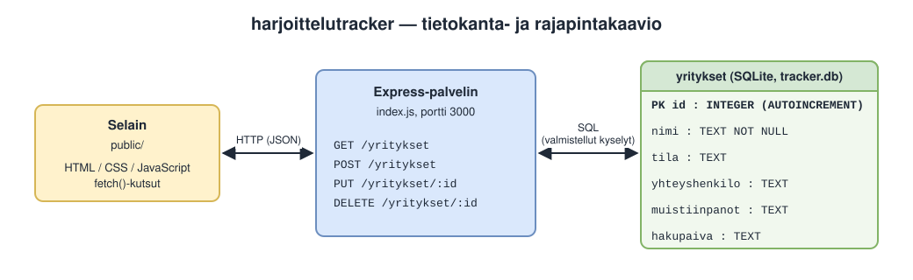

# harjoittelutracker

Työkalu omien työssäoppimispaikkahakemusten seurantaan — mitä yrityksiä olen hakenut, missä vaiheessa hakuprosessi on, ja muistiinpanot kustakin. Rakennettu koska tarvitsin itse tavan pitää kirjaa hauista ensi vuoden työssäoppimispaikkaa varten.

Lopputehtävässä projekti on toteutettu tilaustyönä: tilaaja (työnantaja) Lauri Ahmas, Taitotalo; toteuttaja Tony Weckström.

## Käytetyt tekniikat

- Node.js + Express (backend, REST-rajapinta)
- SQLite (`node:sqlite`, sisäänrakennettu tietokanta — ei ulkoisia riippuvuuksia)
- HTML/CSS/JavaScript (frontend)

## Käyttö

1. Kloonaa repo
2. Aja `npm install` (asentaa Expressin)
3. Aja `npm start`
4. Avaa selaimessa `localhost:3000`

## Miksi oma backend

Data tallennetaan omaan SQLite-tietokantaan valmiin pilvipalvelun (esim. Firebase) sijaan tarkoituksella — tavoitteena oli oppia rakentamaan REST-rajapinta ja tietokantayhteys itse alusta asti, ei vain käyttää valmista ratkaisua.

## Rakenne

```
harjoittelutracker/
├── index.js          # Express-palvelin ja API-reitit
├── tracker.db        # SQLite-tietokanta (syntyy ajettaessa)
├── public/           # Selainpuoli (HTML, CSS, JS)
├── documents/        # Lopputehtävän dokumentit
└── Readme.md
```

## Arkkitehtuuri ja tietokanta



Kaavion lähdetiedosto (draw.io): [harjoittelutracker.drawio](documents/harjoittelutracker.drawio).

## API

| Metodi | Reitti | Kuvaus |
|--------|--------|--------|
| GET | `/yritykset` | Hakee kaikki yritykset |
| POST | `/yritykset` | Lisää uuden yrityksen |
| PUT | `/yritykset/:id` | Päivittää yrityksen |
| DELETE | `/yritykset/:id` | Poistaa yrityksen |

Tietokantataulu: `yritykset` (6 kenttää, ks. kaavio yllä).

## Dokumentit

Lopputehtävän dokumentit ovat kansiossa [`documents/`](documents/):

- [Projektisuunnitelma](documents/plan.md)
- [Aikataulu](documents/timetable.md)
- [Testaussuunnitelma](documents/testplan.md)
- [Testausraportti](documents/testraport.md)
- [UML/ER-kaavio](documents/harjoittelutracker.svg) ([draw.io-lähde](documents/harjoittelutracker.drawio))

## Testauksen tilanne

API-testit ajettiin 5.10.2026 kahdesti. Ajossa 1 löytyi kolme virhettä (tyhjä nimi hyväksyttiin, puuttuvat kentät aiheuttivat HTTP 500 -virheen, olemattoman id:n päivitys ja poisto palauttivat onnistumisen). Ne korjattiin `index.js`:ään, ja ajossa 2 kaikki 10 ajettua testiä meni läpi. Käyttöliittymätesti (TC-UI-01) ajettiin selaimella ja meni läpi, ja `innerHTML`-tietoturvakorjaus varmistettiin (ajo 3). Yhteensä 11/11 testiä läpi. Yksityiskohdat: [testraport.md](documents/testraport.md).

## Lisenssi

MIT, ks. [LICENSE](LICENSE).
